# Capstone Project 3: Blue-Green Deployment Strategy

A zero-downtime deployment strategy for a three-tier web application on AWS, using Application Load Balancer-based traffic switching between Blue (current) and Green (new) environments, with automated rollback driven by CloudWatch alarms.

**Author:** Omao Machoka (Joash) — Moringa AWS DevOps, Week 3
**AWS Account:** 574128098399 (`comraid` student lab) · **Region:** eu-west-1 (Ireland)
**ALB DNS:** `bluegreen-alb-1629631294.eu-west-1.elb.amazonaws.com`

---

## Scenario

A Nairobi-based telecommunications provider runs a three-tier web application (EC2 web tier behind an ALB, optional ECS app tier, RDS data tier). The CTO requires zero-downtime deployments for web-tier updates with automated rollback if a new version fails.

**Tasked to:** Design a Blue-Green deployment strategy, switch traffic safely between environments, and ensure automated rollback if the new version fails.

## Architecture


The Application Load Balancer's listener default rule forwards port 80 traffic to whichever target group is currently active. Both Blue and Green target groups stay registered to the same load balancer at all times — switching versions is a single change to the listener's default action. CloudWatch alarms watch the active environment for 5xx errors, elevated latency, and unhealthy hosts; if thresholds breach after a switch, an EventBridge rule invokes a Lambda function that flips the listener back automatically.

Full design rationale: [`docs/ARCHITECTURE.md`](docs/ARCHITECTURE.md).

---

## Step 1 — Prepare environments

Two security groups, four EC2 instances across two AZs, and a load balancer with two target groups.

### 1.1 Security groups (chained reference)

The ALB's security group accepts HTTP from anywhere. The EC2 security group accepts HTTP **only from the ALB security group** — so EC2 instances are unreachable from the internet directly. All traffic must go through the ALB.

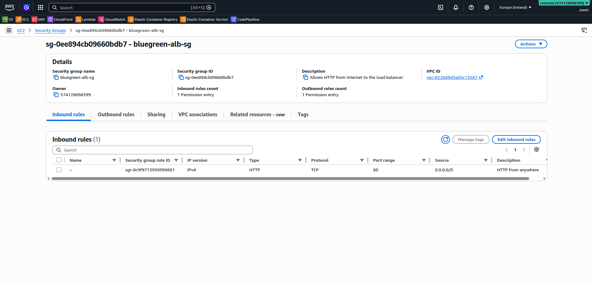
_`bluegreen-alb-sg`: HTTP/80 from `0.0.0.0/0`_

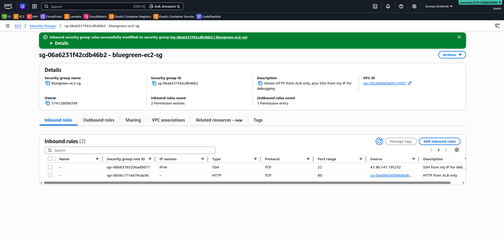
_`bluegreen-ec2-sg`: HTTP/80 from the ALB SG (chained reference), SSH/22 from operator IP_

### 1.2 Blue EC2 instances (multi-AZ)

Two `t2.micro` instances, Amazon Linux 2023, bootstrapped via [`scripts/user-data-blue.sh`](scripts/user-data-blue.sh) which installs nginx and serves a v1.0 page identifying as Blue.

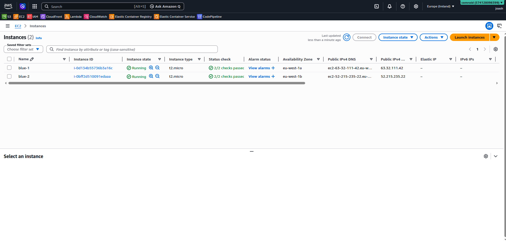
_blue-1 in eu-west-1a, blue-2 in eu-west-1b — multi-AZ for high availability_

### 1.3 Target group `tg-blue`

Health checks on `/health`, interval 15s, healthy/unhealthy threshold 2, success codes 200.

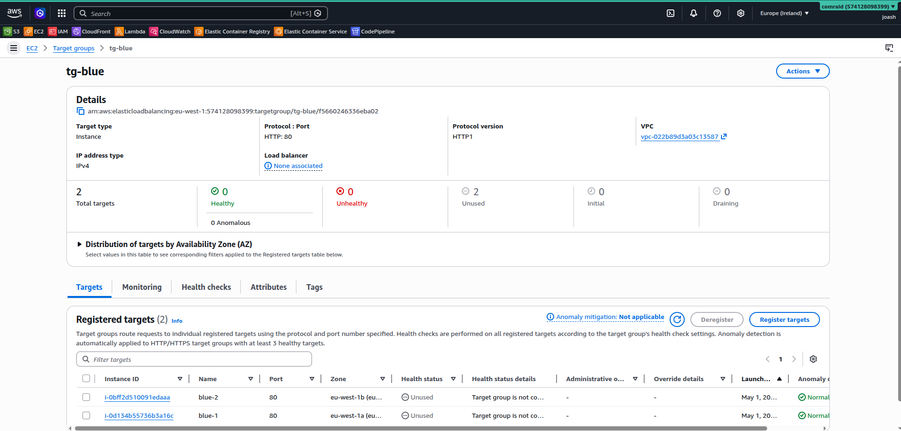
_tg-blue created, instances registered but `Unused` — target groups don't health-check until attached to a load balancer_


_Both Blue instances `healthy` once the ALB attaches and begins health checks_

### 1.4 Application Load Balancer

Internet-facing ALB across both AZs, attached to the ALB security group, with a single listener on HTTP:80 forwarding to `tg-blue`.

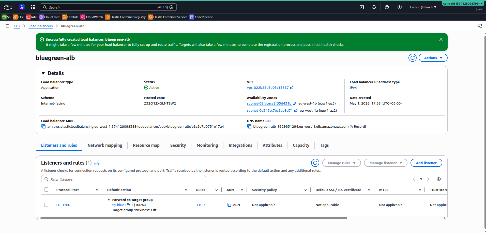
_ALB Active, multi-AZ, public DNS allocated_


_HTTP:80 listener default action: forward to `tg-blue` (production traffic)_

### 1.5 Production traffic verified

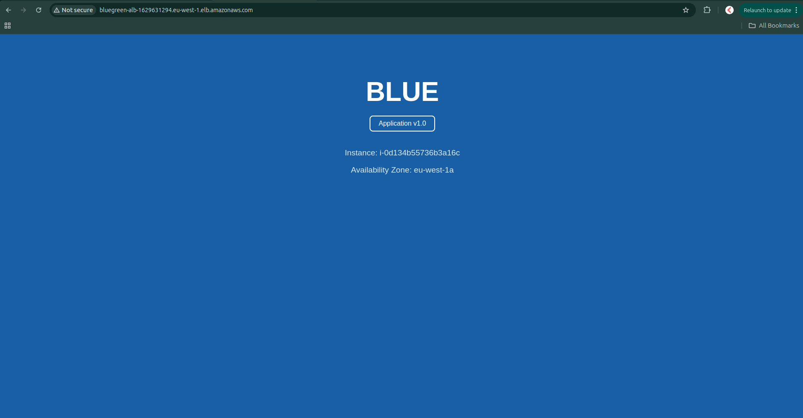
_The ALB DNS root serves the Blue v1.0 page. Refreshing alternates between blue-1 and blue-2 (round-robin across both AZs)._

---

## Step 2 — Deploy new version to Green

Green is a parity clone of Blue with three differences only: the application content (v2 page), the target group (`tg-green`), and the instance names. Same AMI, same instance type, same security group, same AZ pattern as Blue. This parity is critical — validating Green only matters if Green is configured the way production will be after the switch.

### 2.1 Green EC2 instances (parity with Blue)

Two `t2.micro` instances, Amazon Linux 2023, bootstrapped via [`scripts/user-data-green.sh`](scripts/user-data-green.sh) which installs nginx and serves a v2.0 page identifying as Green.

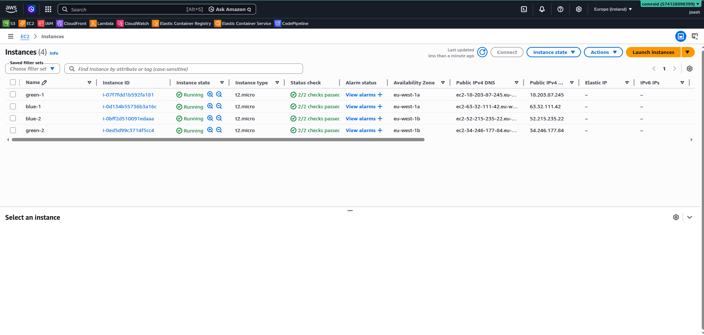
_All four instances Running, 2/2 status checks. green-1 in eu-west-1a, green-2 in eu-west-1b — same AZ pattern as Blue._

### 2.2 Target group `tg-green`

Same health-check settings as `tg-blue` — same definition of "healthy" across both environments.

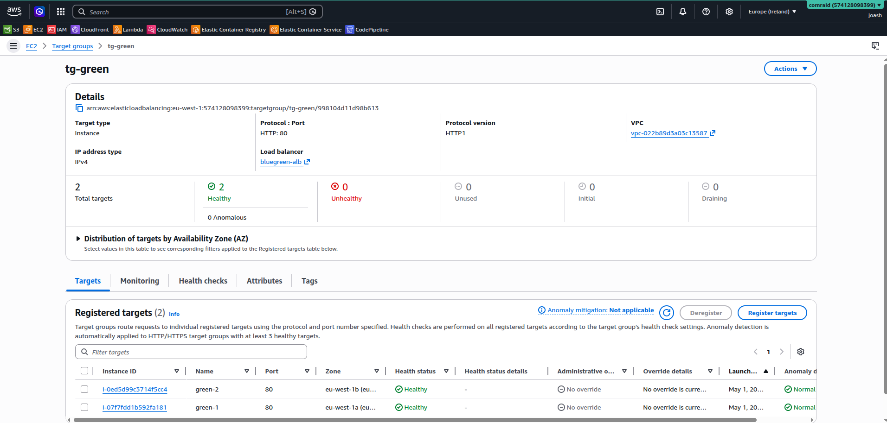
_Both Green instances healthy in tg-green_

### 2.3 Attach tg-green to the ALB via a path-based test rule

Rather than switching the default rule yet, a priority-10 listener rule routes `/green-test*` to `tg-green`. Production traffic continues flowing through the default rule to `tg-blue`, while the test rule lets us validate Green via the same public DNS.

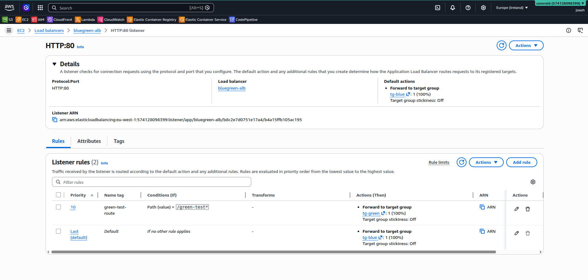
_Two rules: priority 10 → tg-green for `/green-test_`, default → tg-blue for everything else\*

### 2.4 Pre-switch validation: Blue and Green coexisting

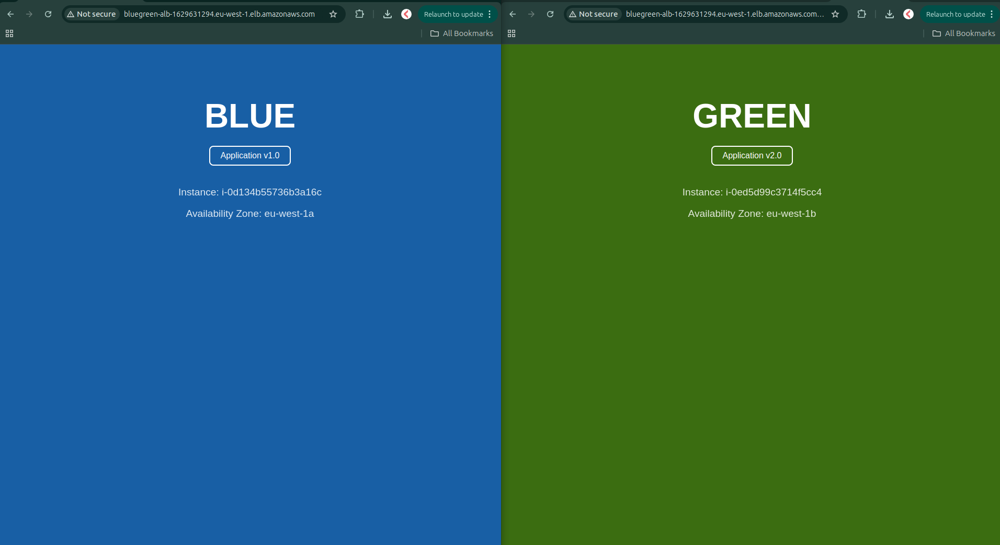
_Same ALB DNS, two paths. Blue v1.0 at `/`, Green v2.0 at `/green-test.html` — Green deployed and reachable, production traffic untouched._

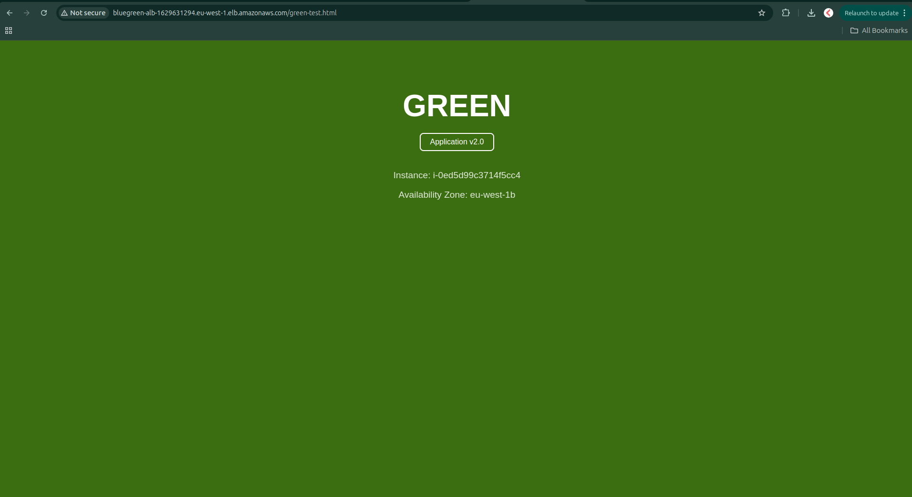
_Green page rendered via the test path — both green-1 and green-2 alternate on refresh_

---

## Step 3 — Configure health checks and validation

### 3.1 Health check configuration

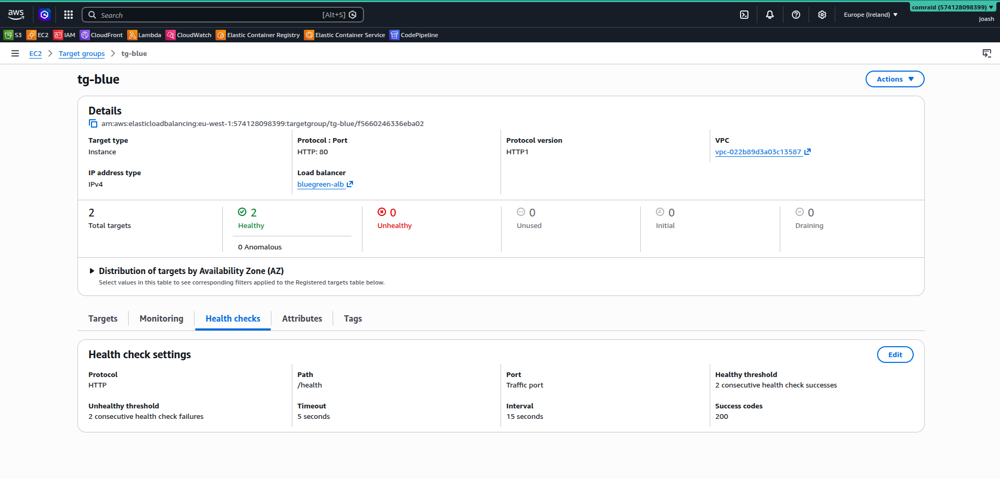
_tg-green health check: path `/health`, 15s interval, threshold 2/2, success codes 200_

### 3.2 Automated smoke test

[`scripts/smoke-test.sh`](scripts/smoke-test.sh) validates Green automatically with a pass/fail exit code. It runs three test groups: 10 reachability requests with latency checks, content verification (page contains GREEN and v2.0, does not contain BLUE), and an AWS API call confirming tg-green has 2/2 healthy targets.

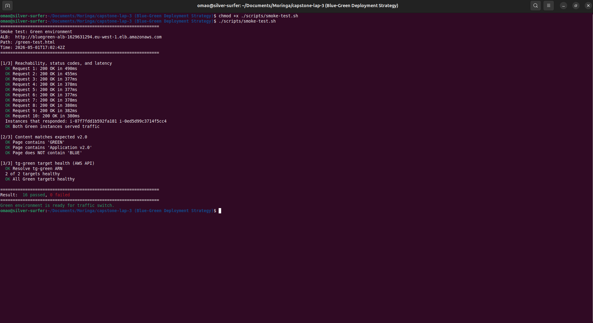
_Smoke test: 16/16 checks passed. Both Green instance IDs appeared in responses (no single point of failure), latency 374-484ms, content checks confirmed v2.0, AWS API confirmed 2/2 healthy. Green is ready for traffic switch._

Procedure documented in [`docs/DEPLOYMENT_GUIDE.md`](docs/DEPLOYMENT_GUIDE.md).

---

## Step 4 — Switch traffic from Blue to Green

The switch is a single config change: the ALB listener's default rule action goes from `forward → tg-blue` to `forward → tg-green`. No DNS change, no client reconfiguration. The ALB DNS users hit stays identical.

Pre-switch state captured below — listener still pointing at tg-blue:

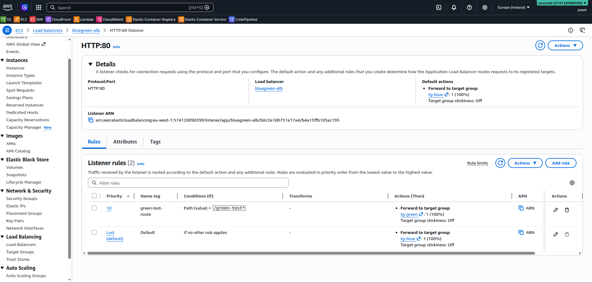
_Default rule: forward to tg-blue (production on Blue, Green standing by)_

After the switch:

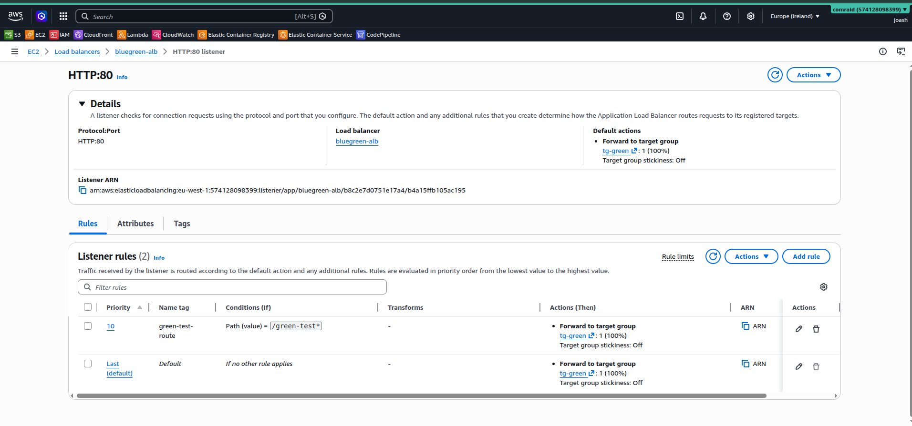
_Default rule: forward to tg-green. Single-line config change at a single layer._

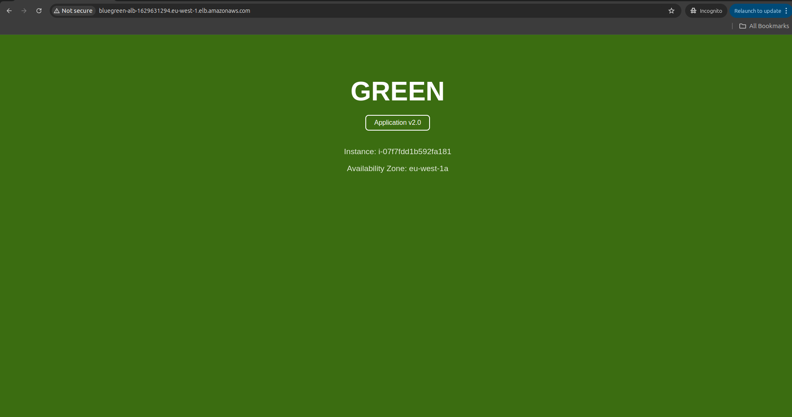
_Same ALB DNS, now serving Green v2.0. Production has been cut over._

**Switch executed at 2026-05-01 19:09 UTC** with zero downtime. A continuous polling loop showed no failed requests during the cutover. Full timeline including the planned procedure and observed behavior: [`docs/TRAFFIC_SWITCH.md`](docs/TRAFFIC_SWITCH.md).

### CloudWatch alarms armed before the switch

Three alarms watch tg-green during and after the switch:

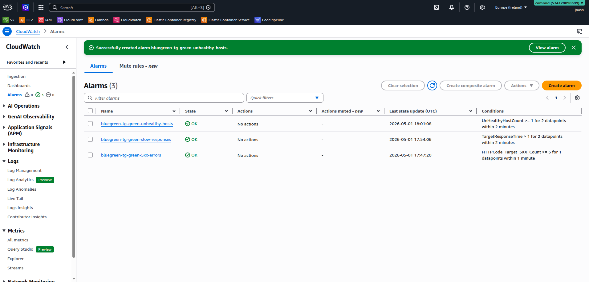
_Top: unhealthy hosts. Middle: slow responses. Bottom: 5xx errors. Each catches a different failure mode; all three wired to the auto-rollback Lambda via EventBridge._

Full alarm definitions and threshold rationale: [`monitoring/alarms.md`](monitoring/alarms.md).

### Traffic shift visible in metrics

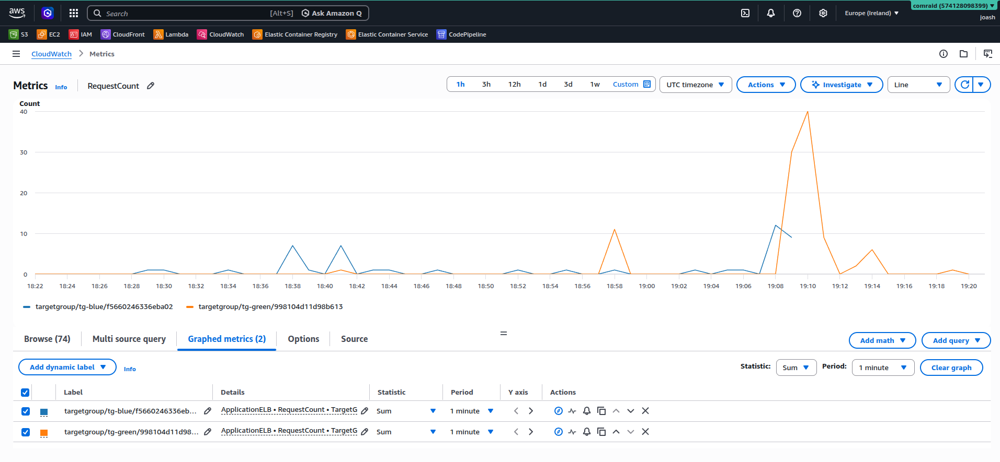
_RequestCount per target group around 19:09 UTC. The X-shape is the cutover: tg-blue (blue line) drops to zero as tg-green (orange line) picks up production traffic. Spike at 19:09 is the watch loop polling once per second to capture the transition._

---

## Step 5 — Rollback (if needed)

Rollback is automated via CloudWatch alarms → EventBridge → Lambda. The Lambda flips the listener's default rule back to `tg-blue`, exactly inverting the switch from Step 4. Manual rollback (the same dropdown change in the AWS console) remains available as a failsafe.

### 5.1 Lambda function

[`automation/lambda-rollback.py`](automation/lambda-rollback.py) — reads the listener's current target group, checks for idempotency (no-op if already on Blue), then modifies the listener.

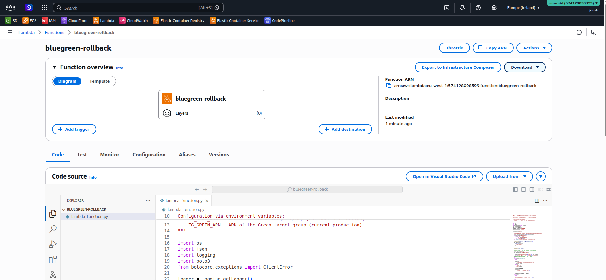
_`bluegreen-rollback` function deployed_

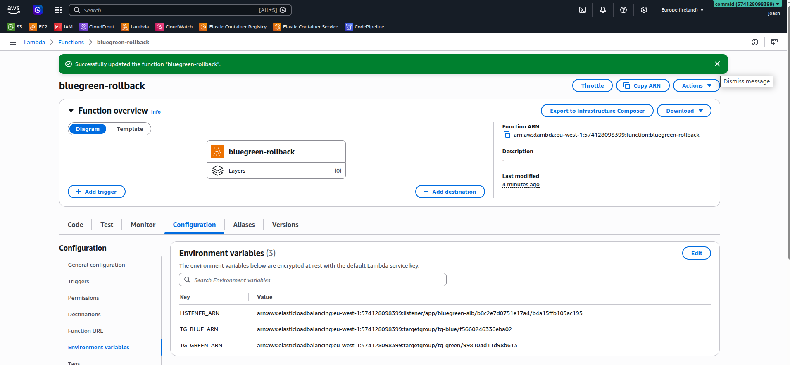
_Configuration via env vars: LISTENER_ARN, TG_BLUE_ARN, TG_GREEN_ARN. Same code redeploys cleanly to other environments._

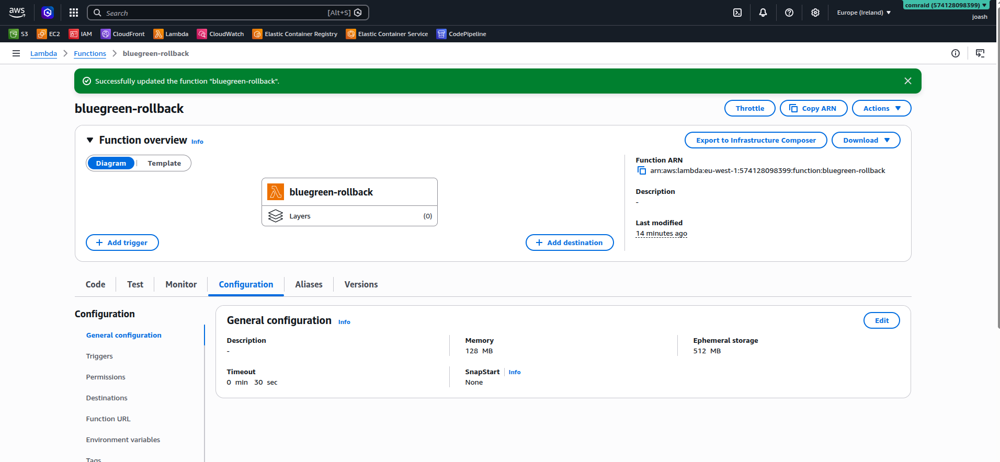
_Timeout raised to 30 seconds (default 3s is too tight for two ELB API calls under network jitter)_

### 5.2 IAM role with least-privilege permissions

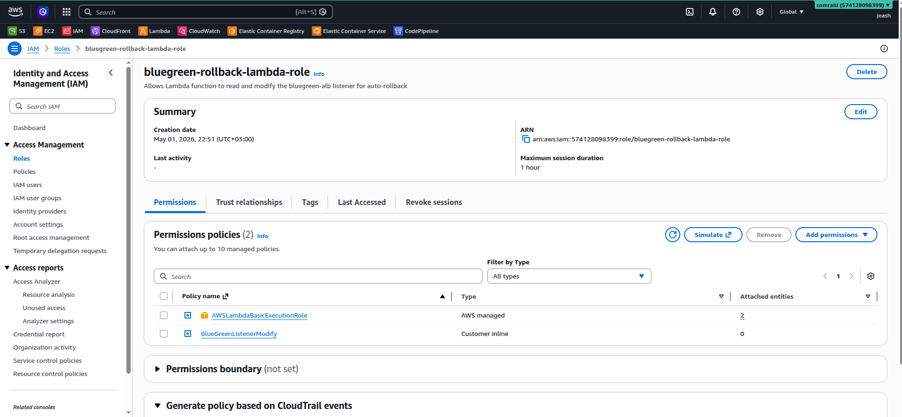
_Two policies: `AWSLambdaBasicExecutionRole` (CloudWatch Logs) and a custom inline policy granting only `elasticloadbalancing:DescribeListeners` and `ModifyListener`_

### 5.3 Lambda tested in isolation

Before wiring to EventBridge, the Lambda was invoked manually with a fake alarm event. The function read the current state (tg-green), flipped to tg-blue, and returned a structured response.

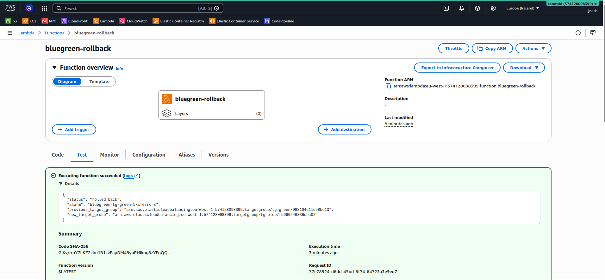
_Manual invocation: status `rolled_back`, previous_target_group tg-green, new_target_group tg-blue. The mechanism works._

### 5.4 EventBridge rule

The bridge between alarm fires and Lambda invocations. Filters at the routing layer so the Lambda only wakes for relevant events.

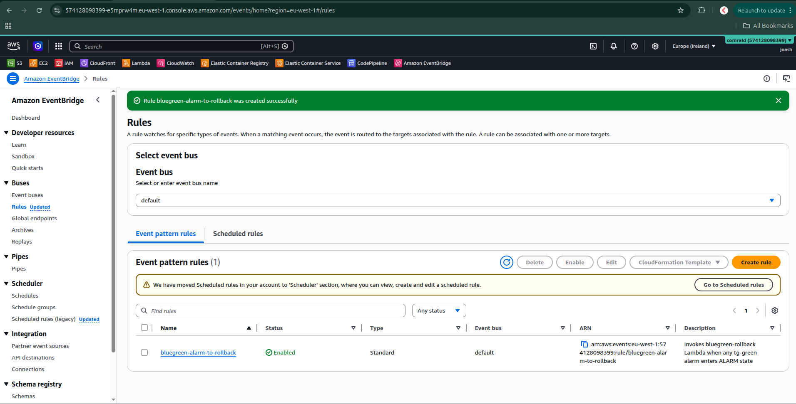
_`bluegreen-alarm-to-rollback`: Enabled, matches CloudWatch Alarm State Change events for our three alarms transitioning to ALARM, invokes the Lambda_

### 5.5 End-to-end test with deliberate failure

To prove the full chain works, the `/health` endpoint was deliberately broken on both Green instances. The expected cascade: ALB marks targets unhealthy → unhealthy-hosts alarm fires → EventBridge invokes Lambda → Lambda flips listener back to Blue.

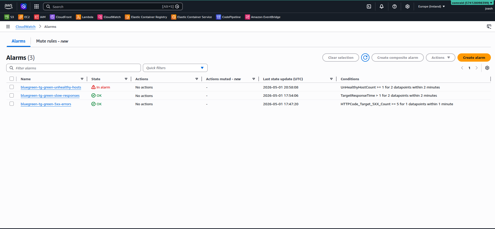
_Unhealthy-hosts alarm transitioned to **In alarm** at 20:58:08 UTC_

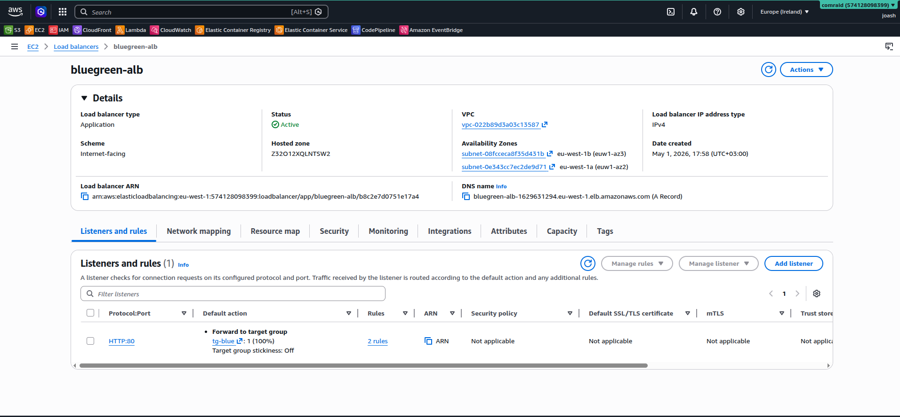
_Listener default rule automatically flipped back to tg-blue by the Lambda — no human intervention_

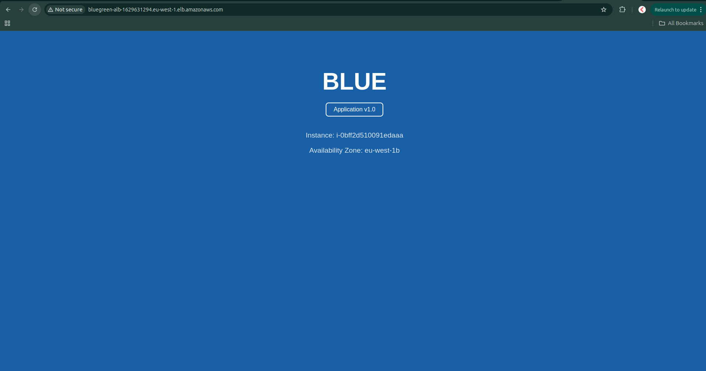
_Same ALB DNS, now serving Blue v1.0 again. Production restored._

**Recovery time: 3 minutes 50 seconds** from initial failure injection to production restored on Blue. The bottleneck is alarm evaluation time (CloudWatch's 1-minute granularity × 2 datapoints required to alarm); the Lambda invocation and ALB modification together took ~15 seconds.

Full architecture, manual fallback procedure, and observed test timeline: [`docs/ROLLBACK_PLAN.md`](docs/ROLLBACK_PLAN.md).

---

## Step 6 — Cleanup and decommission

Production now serves on Blue (the rollback target) following the failure test. The standard playbook from here:

1. Investigate Green offline (instances still running for log inspection)
2. Fix the root cause (in this case, the broken `/health` endpoint)
3. Re-validate via the smoke test
4. Repeat the deployment when ready

For lab teardown after submission, resources are deleted in dependency order: EventBridge rule, Lambda, IAM role, CloudWatch alarms, ALB, target groups, EC2 instances, security groups, key pair.

---

## Rubric mapping

| Criterion         | Weight | Where it lives                                                                                                                                                                                 |
| ----------------- | ------ | ---------------------------------------------------------------------------------------------------------------------------------------------------------------------------------------------- |
| **Architecture**  | 25%    | [`diagrams/architecture.svg`](diagrams/architecture.svg), [`docs/ARCHITECTURE.md`](docs/ARCHITECTURE.md), screenshots Steps 1-2                                                                |
| **Validation**    | 20%    | [`scripts/smoke-test.sh`](scripts/smoke-test.sh) (16/16 pass), [`docs/DEPLOYMENT_GUIDE.md`](docs/DEPLOYMENT_GUIDE.md), parity confirmed in Step 2 screenshots                                  |
| **Monitoring**    | 20%    | [`monitoring/alarms.md`](monitoring/alarms.md), three alarms in Step 4, metrics dashboard X-shape                                                                                              |
| **Reliability**   | 20%    | [`docs/ROLLBACK_PLAN.md`](docs/ROLLBACK_PLAN.md) — manual + automated paths, 3m50s observed RTO, [`automation/lambda-rollback.py`](automation/lambda-rollback.py), full chain proven in Step 5 |
| **Documentation** | 15%    | This README, [`docs/LESSONS_LEARNED.md`](docs/LESSONS_LEARNED.md), planned-vs-observed split in TRAFFIC_SWITCH.md and ROLLBACK_PLAN.md                                                         |

---

## Repository layout

```
.
├── README.md                          ← this file
├── SCREENSHOTS.md                     ← capture checklist (created in Phase 2.5)
├── diagrams/
│   └── architecture.svg
├── docs/
│   ├── ARCHITECTURE.md                ← design decisions
│   ├── DEPLOYMENT_GUIDE.md            ← Green deployment + validation procedure
│   ├── TRAFFIC_SWITCH.md              ← switch runbook (planned + observed)
│   ├── ROLLBACK_PLAN.md               ← rollback paths + end-to-end test results
│   └── LESSONS_LEARNED.md             ← honest reflection, gaps vs production
├── scripts/
│   ├── user-data-blue.sh              ← EC2 bootstrap for Blue
│   ├── user-data-green.sh             ← EC2 bootstrap for Green
│   └── smoke-test.sh                  ← automated Green validation
├── automation/
│   └── lambda-rollback.py             ← auto-rollback Lambda
├── monitoring/
│   └── alarms.md                      ← CloudWatch alarm definitions
└── screenshots/
    ├── 02-blue-environment/           ← SGs, Blue EC2, tg-blue
    ├── 03-alb-and-listener/           ← ALB, listener config
    ├── 04-green-deployment/           ← Green EC2, tg-green, side-by-side
    ├── 05-health-checks/              ← health check config
    ├── 06-smoke-tests/                ← smoke test 16/16
    ├── 07-traffic-switch/             ← listener flip, browser shows Green
    ├── 08-cloudwatch-alarms/          ← three alarms, metrics X-shape
    └── 09-rollback/                   ← Lambda, IAM, EventBridge, end-to-end test
```

---

## Reproducing locally

```bash
# Requires: aws CLI configured for account 574128098399, jq, bc, curl
git clone <this-repo>
cd <this-repo>
chmod +x ./scripts/smoke-test.sh
./scripts/smoke-test.sh
```
