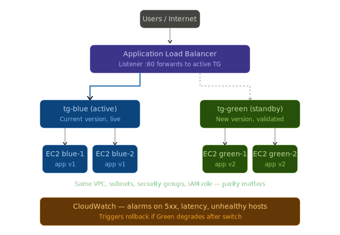

# Capstone Project 3: Blue-Green Deployment Strategy

A zero-downtime deployment strategy for a three-tier web application on AWS, using Application Load Balancer-based traffic switching between Blue (current) and Green (new) environments, with automated rollback driven by CloudWatch alarms.

**Author:** Omao Machoka (Joash) — Moringa AWS DevOps, Week 3
**AWS Account:** 574128098399 (`comraid` student lab)
**Region:** eu-west-1 (Ireland)
**ALB DNS:** `bluegreen-alb-1629631294.eu-west-1.elb.amazonaws.com`

---

## Architecture



The Application Load Balancer's listener default rule forwards port 80 traffic to whichever target group is currently active. Both Blue and Green target groups are registered to the same load balancer at all times — switching versions is a single change to the listener's default action. CloudWatch alarms watch the active environment for 5xx errors, elevated latency, and unhealthy hosts; if thresholds are breached after a switch, an EventBridge rule invokes a Lambda function that flips the listener back automatically.

Full architectural rationale: [`docs/ARCHITECTURE.md`](docs/ARCHITECTURE.md).

---

## How to read this repository (for the marker)

The lab specifies six implementation steps. The repository is organized so each step has a documented procedure and captured evidence:

| Lab step | Procedure | Evidence |
|---|---|---|
| Step 1 — Prepare environments | [`docs/ARCHITECTURE.md`](docs/ARCHITECTURE.md), [`scripts/user-data-blue.sh`](scripts/user-data-blue.sh) | [`screenshots/02-blue-environment/`](screenshots/02-blue-environment/), [`screenshots/03-alb-and-listener/`](screenshots/03-alb-and-listener/) |
| Step 2 — Deploy new version to Green | [`docs/DEPLOYMENT_GUIDE.md`](docs/DEPLOYMENT_GUIDE.md), [`scripts/user-data-green.sh`](scripts/user-data-green.sh) | [`screenshots/04-green-deployment/`](screenshots/04-green-deployment/) |
| Step 3 — Configure health checks | [`docs/DEPLOYMENT_GUIDE.md`](docs/DEPLOYMENT_GUIDE.md) (target group section), [`scripts/smoke-test.sh`](scripts/smoke-test.sh) | [`screenshots/05-health-checks/`](screenshots/05-health-checks/), [`screenshots/06-smoke-tests/`](screenshots/06-smoke-tests/) |
| Step 4 — Switch traffic | [`docs/TRAFFIC_SWITCH.md`](docs/TRAFFIC_SWITCH.md) | [`screenshots/07-traffic-switch/`](screenshots/07-traffic-switch/), [`screenshots/08-cloudwatch-alarms/`](screenshots/08-cloudwatch-alarms/) |
| Step 5 — Rollback (if needed) | [`docs/ROLLBACK_PLAN.md`](docs/ROLLBACK_PLAN.md), [`automation/lambda-rollback.py`](automation/lambda-rollback.py) | [`screenshots/09-rollback/`](screenshots/09-rollback/) |
| Step 6 — Cleanup and decommission | This README (cleanup section below) | [`screenshots/10-cleanup/`](screenshots/10-cleanup/) |

---

## Rubric mapping

| Criterion | Weight | Where it lives |
|---|---|---|
| **Architecture** | 25% | [`diagrams/architecture.svg`](diagrams/architecture.svg), [`docs/ARCHITECTURE.md`](docs/ARCHITECTURE.md) |
| **Validation** | 20% | [`scripts/smoke-test.sh`](scripts/smoke-test.sh) (16/16 checks pass), [`docs/DEPLOYMENT_GUIDE.md`](docs/DEPLOYMENT_GUIDE.md), parity confirmed in screenshots `04-green-deployment/` |
| **Monitoring** | 20% | [`monitoring/alarms.md`](monitoring/alarms.md), three alarms in `screenshots/08-cloudwatch-alarms/`, traffic-switch metrics graph |
| **Reliability** | 20% | [`docs/ROLLBACK_PLAN.md`](docs/ROLLBACK_PLAN.md) — manual + automated paths, end-to-end test with 3m50s observed RTO, [`automation/lambda-rollback.py`](automation/lambda-rollback.py) |
| **Documentation** | 15% | This README, [`docs/LESSONS_LEARNED.md`](docs/LESSONS_LEARNED.md), planned-vs-observed split in TRAFFIC_SWITCH.md and ROLLBACK_PLAN.md |

---

## Repository layout

```
.
├── README.md                          ← you are here
├── diagrams/
│   └── architecture.svg               ← system diagram
├── docs/
│   ├── ARCHITECTURE.md                ← design decisions and component table
│   ├── DEPLOYMENT_GUIDE.md            ← procedure for deploying Green and validating
│   ├── TRAFFIC_SWITCH.md              ← runbook for the Blue→Green switch (planned + observed)
│   ├── ROLLBACK_PLAN.md               ← manual + automated rollback (planned + observed test)
│   └── LESSONS_LEARNED.md             ← honest reflection, gaps vs production
├── scripts/
│   ├── user-data-blue.sh              ← EC2 bootstrap for Blue (nginx + v1 page)
│   ├── user-data-green.sh             ← EC2 bootstrap for Green (nginx + v2 page)
│   └── smoke-test.sh                  ← automated Green validation, exit-coded
├── automation/
│   └── lambda-rollback.py             ← Lambda for auto-rollback on alarm
├── monitoring/
│   └── alarms.md                      ← CloudWatch alarm definitions and rationale
├── screenshots/
│   ├── 01-architecture/               ← architecture diagram captures
│   ├── 02-blue-environment/           ← Blue EC2, SGs, target group
│   ├── 03-alb-and-listener/           ← ALB and listener config
│   ├── 04-green-deployment/           ← Green EC2 launched in parity with Blue
│   ├── 05-health-checks/              ← target group health-check configuration
│   ├── 06-smoke-tests/                ← smoke test passing 16/16
│   ├── 07-traffic-switch/             ← listener flip from tg-blue to tg-green
│   ├── 08-cloudwatch-alarms/          ← three alarms armed
│   ├── 09-rollback/                   ← Lambda, EventBridge, IAM role, end-to-end test
│   └── 10-cleanup/                    ← final cleanup state
└── SCREENSHOTS.md                     ← screenshot capture checklist (created during build)
```

---

## Key results

**Switch to Green executed at 2026-05-01 19:09 UTC** with zero downtime. A continuous polling loop showed no failed requests during the cutover. Both Green AZs (eu-west-1a and eu-west-1b) received production traffic immediately after the switch. Full timeline in [`docs/TRAFFIC_SWITCH.md`](docs/TRAFFIC_SWITCH.md).

**Auto-rollback tested end-to-end** by deliberately breaking the `/health` endpoint on both Green instances. Recovery time from initial failure to production restored on Blue: **3 minutes 50 seconds**, dominated by alarm evaluation time (CloudWatch's 1-minute granularity × 2 datapoints required). The Lambda invocation and ALB modification together took ~15 seconds. Full timeline in [`docs/ROLLBACK_PLAN.md`](docs/ROLLBACK_PLAN.md).

**Smoke test result:** 16/16 checks passed. Both Green instance IDs appeared in responses (no single point of failure), latency 374-484 ms, content matched expected v2.0, ALB confirmed 2/2 healthy targets via the AWS API.

---

## Reproducing this locally

To run the smoke test against the deployed environment:

```bash
# Requires: aws CLI configured for account 574128098399, jq, bc, curl
git clone <this-repo>
cd <this-repo>
./scripts/smoke-test.sh
```

To inspect the Lambda function locally before deploying:

```bash
cat automation/lambda-rollback.py
```

The user-data scripts (`scripts/user-data-blue.sh`, `scripts/user-data-green.sh`) are designed to be pasted directly into the EC2 launch wizard's user data field, or referenced from a Launch Template.

---

## Cleanup

After submission, the lab environment will be torn down to avoid charges:

1. Delete the EventBridge rule `bluegreen-alarm-to-rollback`
2. Delete the Lambda function `bluegreen-rollback`
3. Delete the IAM role `bluegreen-rollback-lambda-role`
4. Delete the three CloudWatch alarms
5. Delete the ALB `bluegreen-alb`
6. Delete the target groups `tg-blue` and `tg-green`
7. Terminate the four EC2 instances
8. Delete the security groups `bluegreen-alb-sg` and `bluegreen-ec2-sg`
9. Delete the key pair `bluegreen-lab-key`

Order matters — the ALB must be deleted before its security group, security groups must have no dependencies before deletion, and the IAM role can only be deleted after the Lambda function that uses it.

---

## Acknowledgements

This project was built as a step-by-step lab with deliberate emphasis on understanding *why* each AWS primitive exists and *how* they connect, not just clicking through to a working result. The planned-vs-observed split in the runbooks reflects how real production deploys are documented at site reliability practice.
# capstone-lap-3-Blue-Green-Deployment-Strategy-
